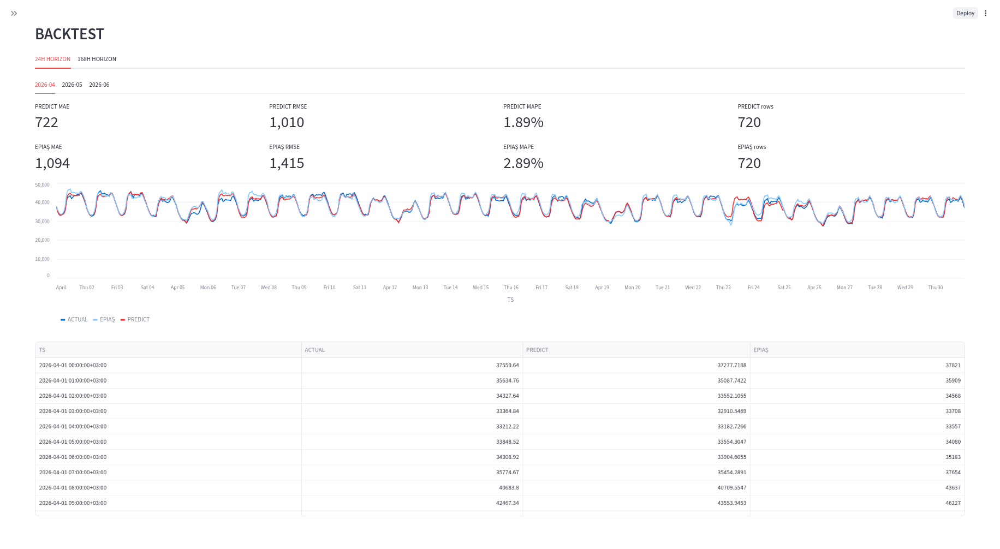
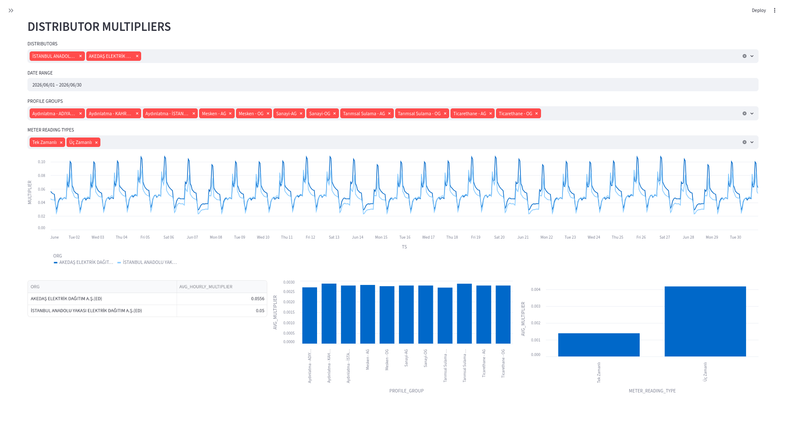
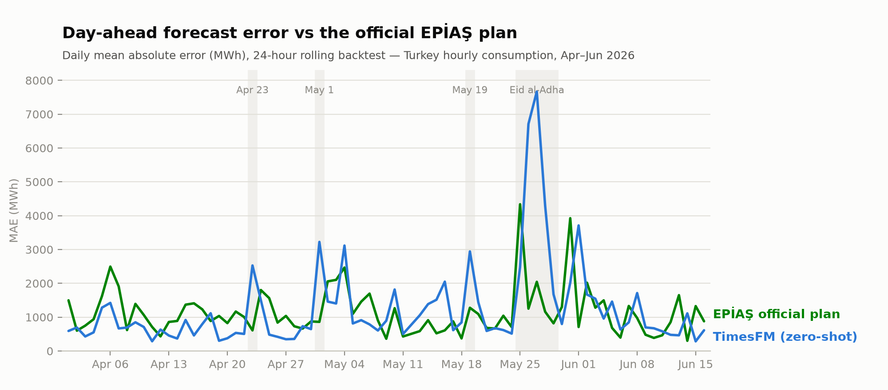

I led the AI and data work on this completed forecasting application, working with Universal Software's energy team to turn live Turkish electricity-market data into reproducible forecasts, rolling backtests, and distributor-level analysis.

**24 h and 168 h horizons** · **~1,800 scored hours per reported horizon** · **21 distribution companies** · **Status: completed**

The central question was deliberately practical: *can a zero-shot time-series foundation model compete with the official hourly load-estimation plan published by EPİAŞ, without training a custom model or engineering calendar and weather features?*

## What I Built

**Data pipeline** — A client for the EPİAŞ Transparency Platform, including CAS ticket authentication and incremental updates, that retrieves hourly real-time consumption back to 2020, EPİAŞ's published load-estimation plan, and meter data for all 21 Turkish distribution companies. The pipeline stores analysis-ready Parquet datasets and processes them with Polars.

**Forecasting engine** — TimesFM 2.5 (200M, PyTorch) running zero-shot with a 1,024-hour context window and quantile heads. Forecasts are generated in rolling 24-hour windows and support both day-ahead and week-ahead analysis.

**Streamlit application** — A single interface for live forecasts, rolling backtests, and distributor analysis:

- **Forecast:** compare a generated forecast with observed demand and EPİAŞ's published plan.
- **Backtest:** evaluate 24-hour and 168-hour horizons over multiple forecast origins with MAE, RMSE, and MAPE. Every backtest uses only information that was available when its forecast would have been issued; cached artifacts make repeated analysis immediate.
- **Distributor dashboard:** explore hourly meter multipliers across distributors, profile groups, and meter-reading types.

*The complete backtest application view. The metric cards and overlaid series make model-versus-baseline performance auditable down to the underlying hourly rows.*

*The full distributor workspace. Energy specialists can move from system-level forecasting to operational comparisons across companies and customer profiles without leaving the application.*

## Verified Result: Competitive Until the Calendar Changes

Rolling-origin backtests across April–June 2026 used multiple forecast dates at both horizons. Each forecast was evaluated against the actual consumption later observed and the EPİAŞ plan that was available at forecast time.

| MAPE (lower is better) | TimesFM zero-shot | EPİAŞ published plan |
|---|---:|---:|
| 24 h — all reported hours | 3.47% | **3.13%** |
| 24 h — excluding public holidays | **2.39%** | 2.92% |
| 24 h — April 2026 | **1.89%** | 2.89% |
| 168 h — April 2026 | **2.59%** | 2.96% |
| 24 h — public holidays only | 12.67% | **4.89%** |

*The failure mode is visible rather than hidden: TimesFM's largest errors coincide with public holidays, particularly Eid al-Adha.*

The result is useful precisely because it is not a universal win. On ordinary days, the zero-shot model beat the EPİAŞ baseline: **2.39% versus 2.92% MAPE**. During public holidays, the ranking reversed sharply: **12.67% versus 4.89%**.

That gap is explainable. A purely historical model can learn daily and weekly demand rhythms, but it cannot know that a national holiday will abruptly change them. At the 168-hour horizon, the effect can also persist after a holiday because the depressed demand remains inside the context window.

## Why This Project Matters

- It tests a foundation model against a meaningful operational baseline rather than an artificially weak benchmark.
- Its rolling evaluation uses multiple issue dates, two horizons, and prediction-time-available information.
- It joins data ingestion, model inference, reproducible evaluation, and domain-facing analysis in one application.
- Its main failure produced a concrete conclusion: calendar awareness is the highest-value next modeling improvement, not a larger univariate model.

Earlier experiments included ARIMA, gradient boosting, and custom PyTorch models. The completed system reflects the engineering decision that followed: use the zero-shot model where it is competitive, measure it honestly against EPİAŞ, and make the remaining limitation explicit.
