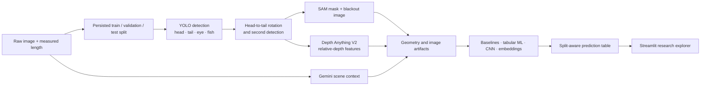

Fishometry is my completed master's-thesis research pipeline for estimating fish length from a single image without a ruler, calibration target, or other physical reference. I designed the data workflow, computer-vision pipeline, experiment matrix, and analysis application end to end. The written thesis and public results package are now being prepared.

**3 dataset variants** · **Controlled and outdoor imagery** · **Held-out test design** · **Research complete**

The project began with a difficult question: *how much physical-length information can a model recover when an image contains no explicit scale?*

## The Scientific Constraint

Absolute size from one ordinary monocular image is fundamentally ambiguous. A small fish close to the camera can occupy the same number of pixels as a larger fish farther away. Relative depth estimators can describe which parts of a scene appear nearer or farther, but they do not automatically provide centimeters.

Fishometry therefore studies learned estimation within defined data distributions: controlled laboratory photographs, zoom-derived versions, and heterogeneous outdoor images spanning multiple fish types and scene conditions.

The evaluation asks whether geometry, relative depth, segmentation, species, and scene context improve held-out estimates beyond simple baselines—and whether those signals survive changes in scale and environment.

## Research Pipeline

Each stage writes an explicit artifact consumed by the next, making image losses, derived features, and experiment outputs inspectable.

## Protecting the Experimental Split

The first stage persists mutually exclusive training, validation, and test assignments before preprocessing or fitting. Test targets are not used for model selection.

Each controlled photograph produces an original, zoom-in, and zoom-out image. Fishometry inherits the source image's assignment across the family, preventing a model from training on one version and being tested on a near-duplicate.

Three dataset variants serve different research questions:

| Dataset | Purpose |
| --- | --- |
| **Controlled** | Establish what can be learned from consistent laboratory images with measured lengths |
| **Controlled + zoom** | Test sensitivity to apparent scale without changing the underlying fish or target length |
| **Outdoor multi-species** | Test a more heterogeneous setting with different fish types, backgrounds, lighting, placement, and surrounding objects |

## Turning an Image Into Measurements

The preprocessing pipeline combines multiple views of the same evidence:

1. **Detection and alignment:** YOLO identifies the fish and available anatomical landmarks. Head and tail centers define a horizontal rotation, followed by a second detection pass on the aligned image.
2. **Segmentation:** Segment Anything produces a binary fish mask. From it, the pipeline derives mask area, perimeter, major and minor axes, solidity, and a fish-only image on a standardized canvas.
3. **Relative depth:** Depth Anything V2 estimates depth at the head, body, and tail, together with raw and absolute gradients. These remain relative scene features, not metric distance.
4. **Scene context:** Gemini extracts structured descriptions such as fish placement, orientation, lighting, nearby objects, and whether the fish appears inside a net.
5. **Geometric features:** Bounding boxes and masks produce relative width, height, area, aspect, eye dimensions, and other normalized measurements.

This design isolates whether anatomical measurements, segmentation geometry, depth, species, or original-scene context contribute signal.

## Controlled Model Matrix

Every dataset begins with a training-only mean baseline. The main experiment families then progress from interpretable tabular models to image representations:

| Model family | Evidence used |
| --- | --- |
| Mean and linear baselines | Training-set length distribution and selected engineered features |
| XGBoost | Nonlinear relationships among geometry, context, species, and optional depth features |
| Tabular MLP | Learned interactions over the same structured feature groups |
| ResNet-18 CNN | Fish-only blackout image combined with auxiliary tabular features |
| EfficientNet-B3 + Ridge | Frozen rotated-image embeddings joined with structured features, with global and fish-type-specific estimators |

Controlled experiments compare eye and coordinate feature groups with and without depth. Outdoor experiments compare geometry against richer segmentation and scene features, again with and without depth, and evaluate global versus fish-type-specific modeling.

Validation data controls XGBoost early stopping and neural checkpoint selection where required. The test split remains held out during fitting and selection. Predictions are joined by image name so the analysis layer can compare aligned rows across models.

## Analysis Application

A Streamlit research application explores results rather than reducing the study to one leaderboard number. It supports split-specific metrics, global and per-fish-type comparisons, correlation views, model-to-model analysis, and image-level inspection of predictions and processed artifacts.

MAE, MAPE, and R² are calculated in the visualization layer. Reporting must explicitly select the test split; unfiltered metrics would mix training, validation, and test rows and would not represent held-out performance.

## Publication Status

The pipeline and experimental implementation are complete. Quantitative thesis results, final comparison tables, and representative prediction images are being prepared as part of the written thesis and are **not claimed on this page yet**. This page documents the completed research design without substituting preliminary or unverified numbers for the final held-out analysis.

## Current Boundaries

- A single uncalibrated image cannot provide universally identifiable physical scale; conclusions are distribution-dependent.
- Depth Anything supplies relative depth, not camera-to-object distance in physical units.
- Detection, segmentation, or missing-image failures can reduce the number of rows that reach later experiments, so model comparisons must use aligned surviving samples.
- Outdoor generalization must be judged by held-out species and scene behavior, not by performance on controlled photographs.

## What This Project Demonstrates

- **Research design before model selection:** persisted splits and family-safe augmentation protect the central comparison from leakage.
- **Multi-stage computer vision:** detection, alignment, segmentation, depth, context, and learned image features contribute distinct evidence.
- **Baseline discipline:** simple mean and linear estimators remain part of the same experiment matrix as deep models.
- **Honest problem framing:** the work tests learned monocular estimation without claiming that a reference-free image removes physical scale ambiguity.
- **Reproducible analysis:** named artifacts and split-aware predictions connect each displayed result to the pipeline that produced it.
