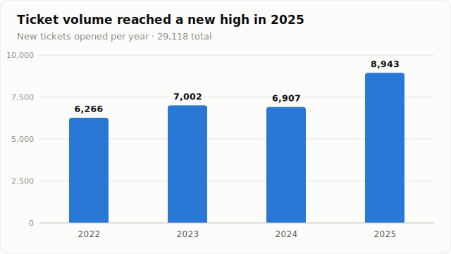
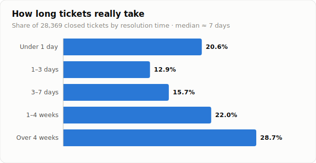
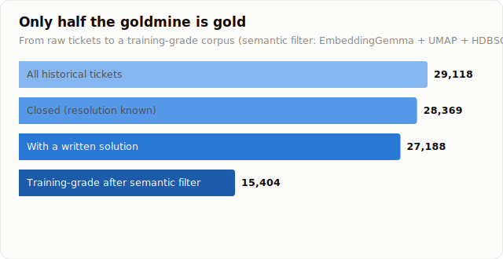
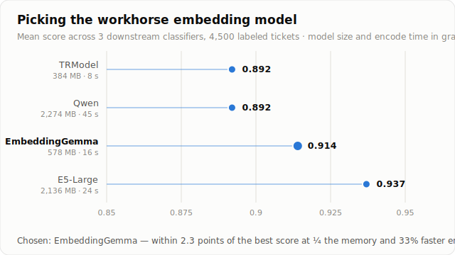
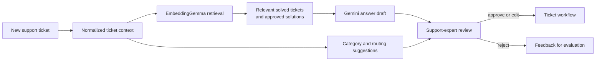

I lead MdsAI's AI and data work across the full lifecycle: support-data strategy, corpus preparation, retrieval and model research, evaluation, and integration with production software. I work directly with support experts to define useful behavior and with software engineers to place that behavior inside the ticket workflow.

**Deployed platform** · **29,118 tickets** · **15,404 training-grade cases** · **Human approval before action** · **Active production and R&D**

The platform uses four years of real support history to retrieve relevant solved cases, draft answers with an LLM, suggest operational decisions, and expose process patterns. It is decision support, not autonomous support: an expert reviews, edits, accepts, or rejects every generated answer before it reaches a customer.

## The Production Problem

The existing Redmine-style system contained valuable solutions, but they were trapped in years of event logs. Keyword search missed semantically equivalent issues, duplicate problems were solved repeatedly, and categorization, assignment, and deadline-risk decisions depended on individual experience.

The raw source contained **132,497 process-log rows** representing **29,118 tickets** from 2022–2025. A ticket could appear many times as comments, status changes, and reassignments accumulated, while fields mixed missing values, inconsistent types, placeholders, SQL fragments, Turkish domain terminology, and product-specific error codes.

My first responsibility was therefore not prompting an LLM. It was building a trustworthy knowledge source.

## Building the Knowledge Corpus

A Polars and Parquet pipeline standardizes identifiers and timestamps, converts placeholder values to nulls, preserves technical tokens, and aggregates event histories into ticket-level records. The normalized analysis snapshot contains **130,168 process rows**.

| Corpus measure | Verified value |
| :--- | ---: |
| Raw process-log rows | 132,497 |
| Normalized analysis rows | 130,168 |
| Unique tickets | 29,118 |
| Closed / resolution known | 28,369 |
| Closed with a written solution | 27,188 |
| Training-grade after semantic review | 15,404 |

The cleaned history also quantified why better decision support matters. Median resolution time was approximately seven days, 28.7% of resolved tickets took longer than four weeks, and only 20.6% were resolved within one day. Among 20,282 tickets with both a planned and actual closing date, 98.5% closed after the planned date—evidence that the planning field was not a dependable estimate.

### Semantic filtering with humans in the loop

Syntactically valid tickets were not automatically useful training examples. Test records, thanks-only replies, template answers, and solutions without technical content could all poison retrieval or supervised learning.

I embedded ticket text with `google/embeddinggemma-300m`, reduced the vectors with UMAP, and grouped dense semantic patterns with HDBSCAN. The clustering did **not** decide what was good or bad. It changed the scale of review: support experts and I could inspect coherent groups instead of auditing 29,000 rows individually, then label clusters as useful knowledge or low-value material.

That review retained **79 corpus-quality clusters** containing **15,404 tickets**, or 52.9% of the original ticket set.

These 79 groups are quality-control clusters. They are separate from the **281 topic-model clusters** later produced by BERTopic to analyze support themes and trends.

## Choosing the Retrieval Foundation

Retrieval, duplicate detection, clustering, and text classification all depend on the embedding layer. I compared four model families with three downstream classifiers on 4,500 labeled tickets, measuring predictive quality alongside memory and encoding time.

| Model | Memory | Encode time | Mean downstream score |
| :--- | ---: | ---: | ---: |
| TRModel | ~384 MB | 8 s | 0.892 |
| Qwen | 2,274 MB | 45 s | 0.892 |
| **EmbeddingGemma** | **578 MB** | **16 s** | **0.914** |
| E5-Large | 2,136 MB | 24 s | 0.937 |

E5-Large produced the highest score, but EmbeddingGemma became the production workhorse: it remained within 2.3 points while using roughly one quarter of the memory and encoding 33% faster.

The same evaluation exposed a taxonomy problem. The source system had 194 category labels, including near-duplicates and classes with fewer than ten examples. Predicting those raw labels produced approximately 0.14 macro-F1. Support-led consolidation created seven operationally coherent groups, on which the model reached 0.46 macro-F1 and 0.67 accuracy. These are different prediction tasks, so the comparison is evidence for redesigning the taxonomy—not a claim that the model itself improved threefold.

## The Deployed LLM Workflow

The deployed assistant retrieves semantically similar solved tickets and supplies their approved solutions as grounded context to Gemini. The resulting draft appears with supporting cases inside the support workflow. An expert remains responsible for the final answer, turning the LLM into an accelerator whose evidence can be inspected rather than an autonomous responder.

| State | Capability |
| :--- | :--- |
| **Deployed** | Hybrid retrieval, evidence-backed LLM answer drafts, expert approval workflow, and support-facing integration |
| **Measured research** | Corpus-quality filtering, embedding benchmarking, taxonomy redesign, classification experiments, and 281-cluster topic analysis |
| **Active development** | Retrieval tuning, production model APIs, assignee and resolution-time models, SLA-risk signals, anomaly detection, and richer trend reporting |

## Evidence and Targets

Measured results and rollout targets remain deliberately separate.

| Measured result | Value |
| :--- | ---: |
| Training-grade corpus | 15,404 tickets |
| Low-value corpus identified before training | 47.1% |
| Selected embedding model | EmbeddingGemma, 0.914 mean downstream score |
| Consolidated-category experiment | 0.46 macro-F1 / 0.67 accuracy |
| Topic-model granularity | 281 thematic clusters |

| Production target | Target value |
| :--- | ---: |
| Reduction in per-ticket handling time | **40%** |
| Expert acceptance of LLM answer drafts | **Above 80%** |
| Human-reviewed SLA warning coverage | **Every eligible new ticket** |

Pilot measurement will determine whether those targets are achieved; they are not presented as current outcomes.

## What This Demonstrates

- **LLM systems begin with knowledge quality.** Retrieval can only be as trustworthy as the solved cases behind it.
- **Human review belongs in the architecture.** Support experts govern both corpus quality and every customer-facing answer.
- **Operational taxonomies matter as much as models.** Redesigning an unusable label space created a prediction task the team could act on.
- **Production trade-offs beat leaderboard choices.** The selected embedding model balanced quality, memory, latency, and continual ingestion.
- **Deployment is part of the research loop.** Expert decisions provide the feedback needed to evaluate retrieval, prompts, routing, and future model services against real support work.
