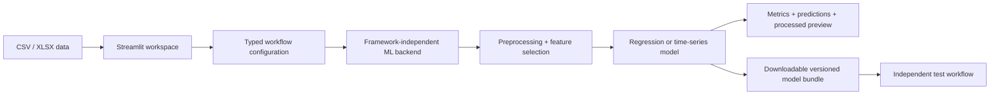

I created MLStudio to make practical machine-learning workflows usable without model-specific code. Its original Tkinter version grew out of real customer requirements and was deployed to more than 30 companies. I was the sole engineer behind its modernization into the current deployed Streamlit application, supported by two testers and retaining full technical ownership of the product.

**30+ predecessor deployments** · **Separate backend and UI** · **14 supervised and time-series model choices** · **Current Streamlit version deployed**

The rewrite was not a cosmetic interface change. It was a product-engineering decision: preserve the trusted modeling workflows, separate them from the UI, and make customer-specific customization and deployment easier than it was in a packaged desktop application.

## From Desktop Product to Web Platform

The Tkinter application proved the need. Companies could train and compare models through a guided interface, but each deployment made the desktop architecture's limits clearer: UI logic and modeling behavior were harder to evolve independently, environment differences complicated delivery, and customer-specific changes increased maintenance cost.

The Streamlit replacement keeps the workflow familiar while changing the system boundary. A browser-based interface is easier to deploy centrally, and Streamlit makes it faster to add or rearrange controls for different use cases. More importantly, the modeling layer is now independent of Streamlit, so the same workflows can be tested or reused without rendering a page.

## Architecture That Protects the Rewrite

MLStudio has two explicit layers:

- `mlstudio/backend/` owns data validation, preprocessing, estimator definitions, feature selection, evaluation, artifact serialization, and train/validate/predict workflows. It has no Streamlit dependency.
- `mlstudio/frontend/` gathers user choices, constructs typed configurations, invokes one backend workflow, and renders the returned result.

The entry point only starts the application. An architecture test parses every backend module and fails if it imports Streamlit or the frontend package. That small constraint prevents the new application from slowly collapsing back into the tightly coupled structure it replaced.

The current repository contains approximately 5,860 lines of Python and defines 49 automated checks covering data validation, model registration, artifact round trips, feature selection, time-aware splits, recursive forecasting, lag selection, and architectural boundaries.

## Supervised Modeling Workspace

The supervised workspace supports three distinct jobs rather than hiding them behind one ambiguous button:

- **Training:** fit a preprocessing-and-model pipeline on selected rows, optionally score a separate test dataset, inspect processed features, and download the fitted bundle.
- **Validation:** use a random split, ordered last split, or cross-validation; optionally run grid search and feature selection; then inspect metrics and out-of-sample predictions.
- **Testing:** upload a trusted MLStudio bundle and new data, validate the required feature contract, generate predictions, and calculate metrics only when the saved target column is present.

Numeric, categorical, string, and boolean features can share one dataset. The saved artifact keeps preprocessing and regression together so training-time transformations are reused during prediction. Current regressors include Random Forest, Gradient Boosting, Support Vector Regression, Extreme Learning Machine, XGBoost, CatBoost, and Voting Regression.

## Neural Time-Series Workspace

Time series are handled as ordered data, not as ordinary shuffled regression. The PyTorch workspace trains MLP, CNN, RNN, GRU, LSTM, Bi-LSTM, and ConvLSTM models over lagged windows from one numeric target series.

Users can inspect autocorrelation diagnostics and select every available lag, explicit indices, the strongest absolute ACF values, or all lags above a threshold. Layer sizes, activations, learning rate, epochs, batch size, and target scaling are configurable. An optional second dataset provides a recursive backtest: predictions are fed back into the model rather than replaced with the actual future values.

Saved `.pt` bundles include the target, training history, lag contract, architecture, scaling configuration, and model state. A bundle can forecast an arbitrary future horizon or compare that horizon with an optional actual-target dataset.

## Evaluation and Safety Decisions

MLStudio calculates R², MAE, RMSE, and MAPE when labels are available. MAPE excludes rows whose actual target is zero and is not reported when every actual value is zero, avoiding a metric that would otherwise be undefined.

Ordered lookback workflows reject random row selection. Their cross-validation and grid-search paths use time-series folds, and recursive validation resets prediction history correctly between evaluations. These restrictions reduce convenient but misleading evaluation choices.

Model bundles use Python serialization, so the application explicitly treats them as trusted artifacts: users should not upload bundles from unknown sources, and producers and consumers must use compatible dependency versions.

## Current Boundaries

The platform does not yet implement missing-value imputation; uploaded data must satisfy the selected workflow's input contract. Cross-environment model compatibility also depends on Python and library versions. The current public environment also exposes two Voting Regressor test failures caused by a nested MLP layer-size value being reapplied as a string; the other 47 checks pass. These are visible engineering constraints rather than details hidden behind the interface.

## What This Project Demonstrates

- **Product evolution informed by use:** the rewrite follows deployment experience from more than 30 companies rather than a hypothetical UI exercise.
- **Architecture as a migration outcome:** the new frontend can change without forcing model logic into page code.
- **Evaluation discipline:** ordered splits and recursive forecasts prevent time-series features from becoming accidental leakage.
- **Reproducible handoff:** preprocessing, model state, feature contracts, and forecast history travel with downloadable artifacts.
- **Engineering beyond the model:** tests, validation, packaging, deployment, and user-facing constraints are part of the ML product.
