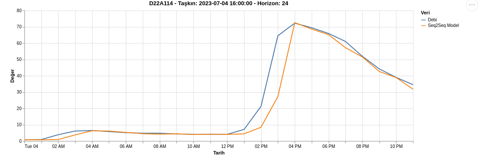
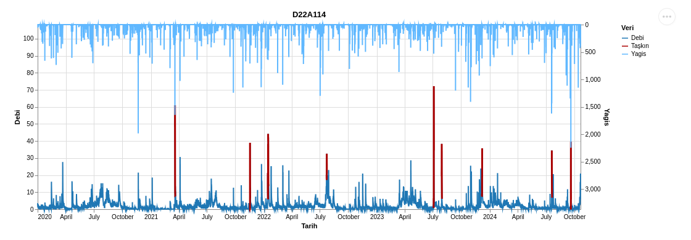
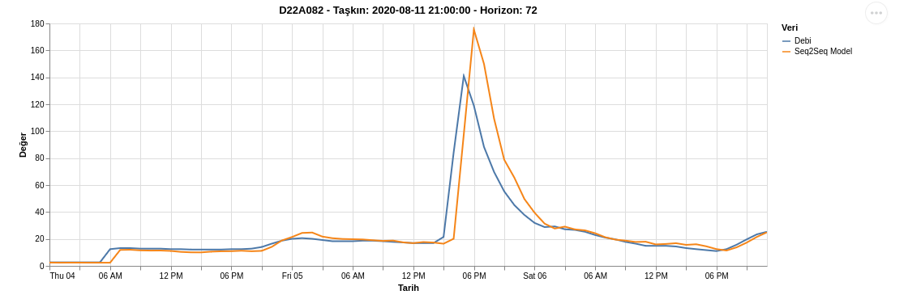
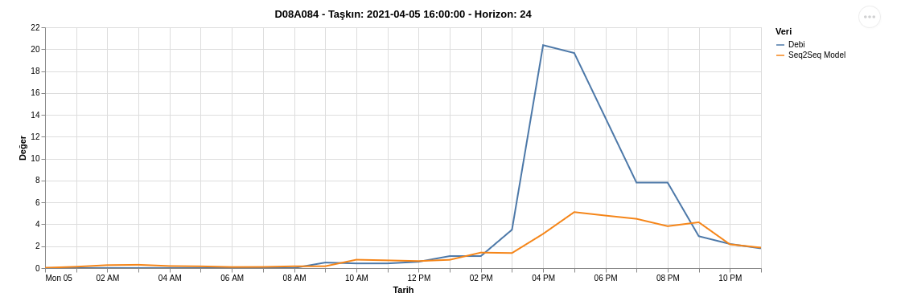
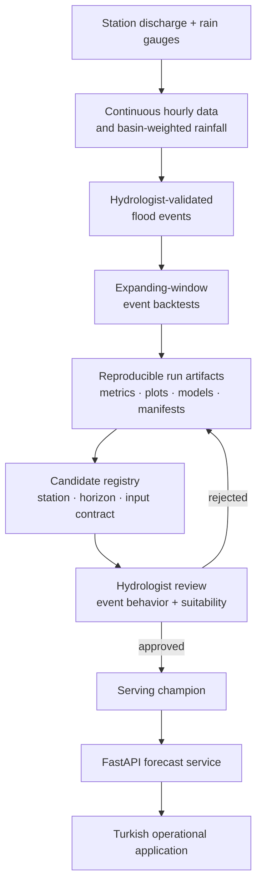

I led Teus's R&D and analytics from raw station data through event-based evaluation and model-serving design. The analytics phase is complete; the project is now with the software team for application development. I continue to coordinate the technical handoff with the hydrologists who validate flood definitions, station behavior, rainfall weighting, and every model considered for operational use.

**72 h forecast horizon** · **5 stations** · **Hydrologist-validated flood events** · **Analytics complete**

*Selected validated event, July 4, 2023, D22A114. Discharge rose from approximately 5 m³/s to 72 m³/s in four hours. The model matched the peak magnitude closely and reached it within an hour; this event's R² was 0.95 and flood-window error was approximately 10%.*

> The charts retain their original Turkish dashboard labels because the system's users and data are Turkish: **Debi** = discharge, **Yağış** = rainfall, **Taşkın** = flood, **Değer** = value, **Tarih** = date.

## Why Early Warning Matters

Flood forecasting is not an abstract benchmark. The World Meteorological Organization reports that weather-, climate-, and water-related disasters caused more than two million deaths and US$4.3 trillion in economic losses between 1970 and 2021; countries with limited-to-moderate early-warning coverage have a disaster-mortality ratio nearly six times higher than countries with substantial coverage. [WMO: Weather forecasts and early warnings](https://public.wmo.int/site/science-action/weather-forecasts-and-early-warnings)

Türkiye has recent evidence of that risk. AFAD reported **82 deaths** after the August 2021 floods in Bartın, Kastamonu, and Sinop. [AFAD: Western Black Sea flood report](https://www.afad.gov.tr/bartin-kastamonu-ve-sinopta-meydana-gelen-yagislar-hakkinda---1-9-1800)

Teus is designed as decision support within that human system: a model can surface an early signal, but hydrologists decide whether its behavior is credible enough to inform an operational workflow.

## The Modeling Problem

Flood events occupy roughly 1% of the studied hourly series. That rarity creates three evaluation traps:

- A model that repeats normal river conditions can score well over the full series while missing the events that matter.
- Flashy basins can move from low baseflow to a severe peak within hours, so discharge history alone provides little warning.
- Random train/test splits leak event structure through time, while normalization over the full series leaks future information.

Ordinary MAPE is also misleading when discharge approaches zero: small absolute errors become extreme percentages and dominate the average. Teus therefore uses **flood-window MAPE** only during hours where discharge exceeds a station-specific, hydrologist-validated event threshold. This preserves an interpretable percentage error for the high-flow period without allowing quiet months to overwhelm the result.

The hydrology team defines and validates station-specific floods against official government values and domain knowledge. The evaluation does not infer operational floods from a generic statistical cutoff.

## Evaluation That Matches Deployment

I built the backtest protocol before comparing architectures:

1. Hydrologists validate flood events and station thresholds using official values.
2. Non-overlapping event windows are evaluated in time order with an expanding training window.
3. Every forecast is produced by a model that has not seen the event's future; normalization is fitted on training rows only and boundaries are purged.
4. Models are scored with flood-window MAE and MAPE, plus a six-hour peak-window MAPE that isolates the most operationally important period.

Rainfall is a first-class input. Basin gauges are weighted using contributions supplied through hydrological studies, while the decoder receives a **three-day external rainfall forecast produced by meteorologists**. That forecast is available when Teus issues its discharge prediction—it is not subsequently observed rainfall introduced during evaluation.

## A Controlled Architecture Comparison

The reported experiment compared five strategies under the same event windows, features, and 24-hour and 72-hour horizons:

| Model | Forecast strategy |
| --- | --- |
| **Seq2Seq encoder–decoder RNN** | Encodes 168 hours of history, then generates the horizon while conditioning on the external rainfall forecast |
| MIMO LSTM / MIMO MLP | Predicts every horizon step in one operation |
| Autoregressive LSTM / MLP | Predicts one step, feeds it back, and repeats |

The table below contains **selected validated-event case studies**, each compared with the strongest baseline on that same event. It illustrates behavior; it is not presented as aggregate performance across every event.

| Station | Selected-event Seq2Seq flood MAPE | Same-event strongest baseline |
| --- | ---: | ---: |
| D22A114 | **8.8%** | 86.4% |
| D13A074 | **8.2%** | 38.5% |
| D08A115 | **22.5%** | 65.2% |
| D22A082 | **22.5%** | 53.7% |
| D08A084 | **34.7%** | 88.8% |

The selected cases expose a consistent architectural difference. MIMO models tended to smooth sharp peaks, while autoregressive models accumulated error across long horizons. Seq2Seq could generate onset, peak, and recession while conditioning each future step on the meteorologist's rainfall sequence.

Two implementation choices were especially important:

- **Scheduled sampling:** the decoder gradually trains on its own outputs instead of seeing only ground-truth histories, reducing drift over 72 generated steps.
- **Forecast rainfall in the decoder:** the architecture matches the operational information flow—past river and rainfall observations establish the basin state, then an available rainfall forecast informs the generated discharge path.

## Selected 72-Hour Case

*Selected validated event, August 2020, D22A082. After two quiet days, observed discharge rose from approximately 20 to 141 m³/s. The 72-hour forecast identified the event day and recession shape but overshot the peak at approximately 177 m³/s. That is useful evidence for hydrologist review, not proof of aggregate system accuracy.*

## Failure Analysis

The system's weakest selected case came from D08A084, a small, flashy basin with low baseflow and limited rainfall lead-in.

*Selected validated event, April 2021. The model identified the timing but predicted approximately 5 m³/s against an observed peak near 20 m³/s.*

The failure is technically informative: relative error becomes unstable near zero, the basin has few historical events, and the available inputs do not fully represent antecedent soil moisture. These findings motivated research into pooled multi-station training and richer basin-state covariates, while the application work proceeds with the completed analytics.

## From Analytics to a Human-Approved Product

Every run records its dataset fingerprint, parameters, environment, predictions, metrics, plots, fitted model, and HTML report. The registry compares technically valid candidates per station, horizon, and input contract. Rain-dependent candidates are eligible only when the external rainfall forecast is supplied.

Technical validation does not deploy a model. It creates a candidate. Hydrologists review its event behavior and operational suitability, and only an explicitly approved checkpoint can become the serving champion. The FastAPI layer discovers approved models at runtime and keeps the last working champion available if a candidate is rejected or fails validation.

## What This Project Demonstrates

- **Evaluation design determines whether a rare-event model is useful.** Event-based, time-ordered backtests prevent normal hours from hiding flood misses.
- **Inputs and architecture must reflect the real forecasting process.** The decoder consumes a meteorologist-produced rainfall forecast that is genuinely available at inference time.
- **Selected successes and failures belong together.** Both are necessary for hydrologists to judge where a model is credible.
- **Human approval is a system boundary.** Model ranking supports domain experts; it does not replace their operational authority.
- **Research artifacts must survive the software handoff.** Reproducible runs, explicit input contracts, and approved checkpoints allow the application team to build on completed analytics without turning a notebook result into an opaque service.
